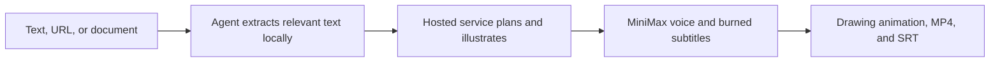

<div align="center">

# Explainer Video Agent Skill

**Turn text, URLs, and documents into narrated hand-drawn videos from Codex, Claude Code, and compatible agent clients.**

[Website](https://speedpainter.org) · [Install](#quick-start) · [Privacy](https://speedpainter.org/en/privacy) · [Support](https://speedpainter.org/en/contact)

</div>

<p align="center">
  <strong>English</strong> ·
  <a href="docs/README.zh-CN.md">简体中文</a> ·
  <a href="docs/README.ja.md">日本語</a> ·
  <a href="docs/README.es.md">Español</a>
</p>

## One prompt in. A finished video out.

Explainer Video combines a portable Agent Skill with a hosted MCP service. Your
agent reads the source locally; the service plans the storyboard, generates a
coherent set of whiteboard illustrations, creates MiniMax narration and burned
subtitles, renders the drawing animation, and returns a published MP4.

No timeline editing, Docker container, local renderer, or API key is required.

## Quick start

### Codex

```bash
codex plugin marketplace add SpeedPainterOrg/explainer-video --ref main
codex plugin add explainer-video@speedpainter
```

Start a new Codex task after installation. The plugin bundles both the Skill and
the remote MCP connection.

### Claude Code

Install the portable Skill:

```bash
npx skills add https://github.com/SpeedPainterOrg/explainer-video \
  --skill create-explainer-video
```

Connect the hosted MCP server for all projects:

```bash
claude mcp add --transport http --scope user \
  explainer-video https://api.speedpainter.org/mcp
```

Open `/mcp` in Claude Code and complete Google sign-in.

### Other compatible clients

Copy `plugins/explainer-video/skills/create-explainer-video/` into the client's
personal or project Skill directory. Then configure this Streamable HTTP MCP
server with OAuth:

```text
https://api.speedpainter.org/mcp
```

The client needs both Agent Skill support and remote MCP OAuth support to run
the complete workflow.

## Ask naturally

```text
Turn this PDF into a 60-second explainer video.

Make a 45-second 9:16 explainer video from this page.

把这些会议记录做成一个简洁的中文白板视频。

Make a video from this.
```

Sensible defaults are filled in automatically: source language, 60 seconds,
16:9, MiniMax narration, no background music, and burned subtitles. You can
override duration, language, aspect ratio, voice, music, or subtitle mode.

Videos can be 5 seconds to 5 minutes. Under 30 seconds is supported, but the
drawing and narration may feel rushed.

## Two creative modes

**Direct generation is the default.** The service handles the storyboard,
images, voice, subtitles, rendering, and publishing in one asynchronous task.
This is the fastest and most consistent route across clients.

**Advanced review is optional.** Ask to review or edit scene images before
rendering. A capable agent can generate the illustrations locally, show them in
numbered storyboard cards, regenerate selected scenes, upload only accepted
images, validate the final manifest, and render without changing the approved
work.

## How it works



The task response reports the renderer's real stage and progress. The Skill
never invents a percentage and follows the server's polling, retry, completion,
and cancellation guidance.

## Capabilities

| | Supported |
| --- | --- |
| Inputs | Text, URLs, PDFs, documents, notes, and existing storyboards accessible to the agent |
| Duration | 5–300 seconds; 60 seconds by default |
| Aspect ratio | 16:9, 9:16, 1:1, and 4:5 |
| Visuals | Editorial hand-drawn whiteboard illustrations and drawing animation |
| Narration | Hosted MiniMax speech synthesis with multilingual defaults |
| Subtitles | Burned into the MP4 by default, with a separate SRT when available |
| Output | Published MP4 URL, subtitle URL, and truthful task status |

## Privacy and authentication

- The original file is read by the agent and is not uploaded by this plugin.
- Direct mode sends the extracted text needed to plan and produce the video.
- Advanced mode sends accepted generated images and the approved render
  manifest; it does not upload the original document.
- Authentication uses MCP OAuth with Google sign-in. A free profile is created
  automatically on first use.
- You never paste an API key, renderer key, storage key, or voice-provider key
  into the conversation.

See the [Privacy Policy](https://speedpainter.org/en/privacy) and
[Terms of Service](https://speedpainter.org/en/terms).

## Updating

Codex:

```bash
codex plugin marketplace upgrade speedpainter
```

Claude Code / standalone Skill:

```bash
npx skills add https://github.com/SpeedPainterOrg/explainer-video \
  --skill create-explainer-video
```

Start a new agent session after updating.

## Repository structure

```text
.
├── .agents/plugins/marketplace.json
└── plugins/explainer-video
    ├── .codex-plugin/plugin.json
    ├── .mcp.json
    └── skills/create-explainer-video
        ├── SKILL.md
        └── references/advanced-review.md
```

This repository contains the source-available distribution. The hosted render
service and backend implementation are proprietary and are not included.

## Links

- [Website](https://speedpainter.org)
- [Privacy Policy](https://speedpainter.org/en/privacy)
- [Terms of Service](https://speedpainter.org/en/terms)
- [Contact support](https://speedpainter.org/en/contact)
- [Report an issue](https://github.com/SpeedPainterOrg/explainer-video/issues)
