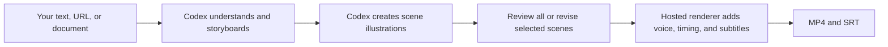

<div align="center">

# Explainer Video for Codex

**Turn text, URLs, and documents into narrated hand-drawn explainer videos—directly from Codex.**

[Website](https://speedpainter.org) · [Install](#quick-start) · [Privacy](https://speedpainter.org/en/privacy) · [Support](https://speedpainter.org/en/contact)

</div>

<p align="center">
  <strong>English</strong> ·
  <a href="docs/README.zh-CN.md">简体中文</a> ·
  <a href="docs/README.ja.md">日本語</a> ·
  <a href="docs/README.es.md">Español</a>
</p>

## One prompt in. A finished video out.

Explainer Video lets Codex handle the editorial work it already does well:
understanding your source, finding the central idea, writing a storyboard, and
creating a coherent set of whiteboard illustrations. The hosted renderer then
turns those approved assets into a narrated MP4 with drawing animation and
burned-in subtitles.

No timeline editing, Docker container, local renderer, or API key is required.

## Quick start

### 1. Install the plugin

```bash
codex plugin marketplace add SpeedPainterOrg/explainer-video --ref main
codex plugin add explainer-video@speedpainter
```

### 2. Start a new Codex task

Plugins are loaded when a task starts. Open a new task after installation and
attach a document, paste some text, or provide a URL.

### 3. Ask for the result you want

```text
Turn this PDF into a 60-second explainer video.
```

The first render opens Google sign-in. After that, Codex carries the workflow
through storyboard, illustration, narration, subtitles, rendering, and delivery.

## What you can ask for

```text
Make a 45-second 9:16 explainer video from this page.

Turn these meeting notes into a concise whiteboard video in Chinese.

Explain this idea for beginners, use a warm editorial drawing style, and burn in subtitles.
```

Short requests work too:

```text
Make a video from this.
```

Codex fills in sensible defaults instead of making you configure a render
pipeline. You can still specify the language, duration, aspect ratio, emphasis,
or narration direction when they matter.

By default, Codex shows the timed storyboard and numbered scene images before
uploading them, so you can approve everything or revise only selected scenes.
Say `skip image review` when you want the fastest path straight to rendering.

## Capabilities

| | Supported |
|---|---|
| Inputs | Text, URLs, PDFs, documents, and notes available to Codex |
| Duration | 5 seconds to 5 minutes; 60 seconds by default |
| Visuals | About one scene per 10 seconds: six scenes for the 60-second default, up to 30 |
| Aspect ratio | 16:9 by default; follow a user-specified format such as 9:16 or 1:1 |
| Narration | Hosted natural-language voice synthesis |
| Subtitles | Burned into the MP4, with a separate SRT when available |
| Output | Published MP4 URL, duration, and scene summary |

Videos shorter than 30 seconds are supported, but 30 seconds or longer usually
gives the narration and drawing animation better pacing.

## How it works



The plugin keeps the creative conversation simple while maintaining a clear
responsibility boundary:

| Codex | Hosted renderer |
|---|---|
| Reads the original source | Receives generated scene images and the approved render manifest |
| Finds the message and audience | Normalizes illustration assets |
| Writes the storyboard, titles, and narration | Handles layout, drawing timing, and voice synthesis |
| Generates the scene illustrations | Burns subtitles, renders, publishes, and reports real task stage and progress |

## Privacy and authentication

- Original documents, URL contents, and private notes remain in Codex.
- The renderer receives only generated scene illustrations and the approved
  manifest needed to produce the video. That manifest contains narration, short
  titles, captions, and render settings.
- Authentication uses MCP OAuth with Google sign-in.
- You never need to paste an API key or service credential into Codex.

See the [Privacy Policy](https://speedpainter.org/en/privacy) and
[Terms of Service](https://speedpainter.org/en/terms) for the hosted service.

## Updating

Refresh the marketplace snapshot to pick up the latest published plugin version:

```bash
codex plugin marketplace upgrade speedpainter
```

Start a new Codex task after updating.

## Repository structure

```text
.
├── .agents/plugins/marketplace.json
└── plugins/explainer-video
    ├── .codex-plugin/plugin.json
    ├── .mcp.json
    └── skills/create-explainer-video/SKILL.md
```

This repository contains the source-available Codex plugin distribution. The
hosted rendering service and backend implementation are proprietary and are not
included here.

## Links

- [SpeedPainter](https://speedpainter.org)
- [Privacy Policy](https://speedpainter.org/en/privacy)
- [Terms of Service](https://speedpainter.org/en/terms)
- [Contact support](https://speedpainter.org/en/contact)
- [Report an issue](https://github.com/SpeedPainterOrg/explainer-video/issues)
