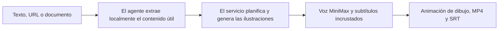

<div align="center">

# Explainer Video Agent Skill

**Convierte texto, páginas web y documentos en vídeos explicativos dibujados a mano desde Codex, Claude Code y otros agentes compatibles.**

[Sitio web](https://speedpainter.org) · [Instalación](#inicio-rápido) · [Privacidad](https://speedpainter.org/en/privacy) · [Soporte](https://speedpainter.org/en/contact)

</div>

<p align="center">
  <a href="../README.md">English</a> ·
  <a href="README.zh-CN.md">简体中文</a> ·
  <a href="README.ja.md">日本語</a> ·
  <strong>Español</strong>
</p>

## Una petición. Un vídeo terminado.

Explainer Video combina una Agent Skill portátil con un servicio MCP alojado.
El agente lee la fuente de forma local; el servicio prepara el guion gráfico,
genera ilustraciones de pizarra coherentes, crea la narración con MiniMax y los
subtítulos incrustados, renderiza la animación de dibujo y devuelve un MP4
publicado.

No necesitas editar una línea de tiempo, desplegar Docker, ejecutar un
renderizador local ni configurar una clave API.

## Mira un resultado real

[](../assets/explainer-video-demo.mp4)

[Ver la demo completa de 20 segundos con narración y subtítulos incrustados.](../assets/explainer-video-demo.mp4)

## Inicio rápido

### Codex

```bash
codex plugin marketplace add SpeedPainterOrg/explainer-video --ref main
codex plugin add explainer-video@speedpainter
```

Abre una tarea nueva de Codex después de instalarlo. El plugin incluye tanto la
Skill como la conexión MCP remota.

### Claude Code — un solo comando

```bash
npx --yes github:SpeedPainterOrg/explainer-video
```

El comando instala la Skill y conecta el MCP alojado para todos tus proyectos
de Claude Code. Abre Claude Code, ejecuta `/mcp` una vez para iniciar sesión con
Google y pide:

> Convierte este documento en un vídeo explicativo de 30 segundos.

### Otros clientes compatibles

Copia `plugins/explainer-video/skills/create-explainer-video/` en el directorio
de Skills personal o del proyecto. Después configura este servidor MCP
Streamable HTTP con OAuth:

```text
https://api.speedpainter.org/mcp
```

El cliente debe ser compatible tanto con Agent Skills como con OAuth para MCP
remoto para ejecutar el flujo completo.

## Pídelo con naturalidad

```text
Convierte este PDF en un vídeo explicativo de 60 segundos.

Crea un vídeo explicativo de 45 segundos en 9:16 a partir de esta página.

Resume estas notas de reunión en un vídeo de pizarra en español.

Haz un vídeo con esto.
```

Los valores predeterminados son: idioma de la fuente, 60 segundos, 16:9,
narración MiniMax, sin música de fondo y subtítulos incrustados. Puedes indicar
la duración, el idioma, la relación de aspecto, la voz, la música o el tipo de
subtítulos.

Cada vídeo puede durar entre 5 segundos y 5 minutos. Se admiten vídeos de menos
de 30 segundos, aunque el dibujo y la narración pueden sentirse acelerados.

## Dos modos creativos

**La generación directa es el modo predeterminado.** El servicio resuelve el
guion gráfico, las imágenes, la voz, los subtítulos, el renderizado y la
publicación en una sola tarea asíncrona. Es la ruta más rápida y uniforme entre
clientes.

**La revisión avanzada es opcional.** Si pides revisar o editar las imágenes de
cada escena antes de renderizar, un agente capaz puede mostrar tarjetas
numeradas, regenerar solo las escenas seleccionadas, subir únicamente las
imágenes aprobadas, validar el manifiesto y conservar todo lo ya aceptado.

## Cómo funciona



El estado de la tarea muestra únicamente la fase y el progreso reales del
renderizador. La Skill no inventa porcentajes y respeta las indicaciones del
servidor para consultar, reintentar, terminar o cancelar.

## Capacidades

| | Compatibilidad |
| --- | --- |
| Entradas | Texto, URL, PDF, documentos, notas y guiones gráficos accesibles para el agente |
| Duración | 5–300 segundos; 60 segundos por defecto |
| Formato | 16:9, 9:16, 1:1 y 4:5 |
| Estilo visual | Ilustraciones editoriales de pizarra y animación de dibujo |
| Narración | Síntesis de voz multilingüe alojada con MiniMax |
| Subtítulos | Incrustados en el MP4 por defecto y SRT separado cuando está disponible |
| Salida | URL pública del MP4, URL de subtítulos y estado real de la tarea |

## Privacidad y autenticación

- El agente lee el archivo original; este plugin no lo sube.
- El modo directo envía solo el texto extraído necesario para crear el vídeo.
- El modo avanzado envía las imágenes generadas aprobadas y el manifiesto, no
  el documento original.
- La autenticación usa MCP OAuth con Google y crea automáticamente una cuenta
  gratuita la primera vez.
- Nunca tienes que pegar en la conversación claves de API, del renderizador,
  del almacenamiento ni del proveedor de voz.

Consulta la [Política de privacidad](https://speedpainter.org/en/privacy) y los
[Términos de servicio](https://speedpainter.org/en/terms).

## Actualización

Codex:

```bash
codex plugin marketplace upgrade speedpainter
```

Claude Code:

```bash
npx --yes github:SpeedPainterOrg/explainer-video
```

Inicia una sesión nueva del agente después de actualizar.

## Enlaces

- [Sitio web](https://speedpainter.org)
- [Política de privacidad](https://speedpainter.org/en/privacy)
- [Términos de servicio](https://speedpainter.org/en/terms)
- [Contactar con soporte](https://speedpainter.org/en/contact)
- [Informar de un problema](https://github.com/SpeedPainterOrg/explainer-video/issues)
