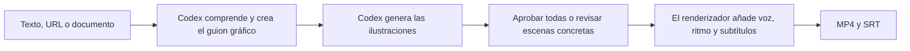

<div align="center">

# Explainer Video para Codex

**Convierte texto, enlaces y documentos en vídeos explicativos dibujados a mano y narrados, directamente desde Codex.**

[Sitio web](https://speedpainter.org) · [Instalación](#inicio-rápido) · [Privacidad](https://speedpainter.org/en/privacy) · [Soporte](https://speedpainter.org/en/contact)

</div>

<p align="center">
  <a href="../README.md">English</a> ·
  <a href="README.zh-CN.md">简体中文</a> ·
  <a href="README.ja.md">日本語</a> ·
  <strong>Español</strong>
</p>

## Una petición. Un vídeo terminado.

Explainer Video deja en manos de Codex el trabajo editorial que mejor sabe hacer: comprender el material original, identificar la idea principal, escribir el guion gráfico y crear una serie coherente de ilustraciones de pizarra. Después, el renderizador alojado convierte los recursos aprobados en un MP4 narrado, con animación de dibujo y subtítulos integrados.

No necesitas editar una línea de tiempo, desplegar Docker, ejecutar un renderizador local ni configurar una clave de API.

## Inicio rápido

### 1. Instala el plugin

```bash
codex plugin marketplace add SpeedPainterOrg/explainer-video --ref main
codex plugin add explainer-video@speedpainter
```

### 2. Abre una tarea nueva en Codex

Los plugins se cargan al iniciar una tarea. Después de instalarlo, crea una tarea nueva y adjunta un documento, pega un texto o proporciona una URL.

### 3. Describe el resultado que quieres

```text
Convierte este PDF en un vídeo explicativo de 60 segundos.
```

El primer renderizado abrirá el inicio de sesión con Google. Una vez autorizado, Codex continuará con el guion gráfico, las ilustraciones, la narración, los subtítulos, el renderizado y la entrega.

## Ejemplos de peticiones

```text
Crea un vídeo explicativo vertical de 45 segundos a partir de esta página.

Resume estas notas de reunión en un vídeo de pizarra conciso en español.

Explica esta idea para principiantes, con un estilo editorial cálido y subtítulos integrados.
```

También puedes pedirlo de forma breve:

```text
Haz un vídeo con esto.
```

Codex completa los ajustes razonables para que no tengas que aprender un sistema de renderizado. Si lo necesitas, puedes indicar el idioma, la duración, la relación de aspecto, el énfasis o el enfoque de la narración.

Por defecto, Codex muestra el guion con tiempos y las imágenes numeradas antes de subirlas. Puedes aprobarlas todas o pedir cambios solo en escenas concretas. Si prefieres el camino más rápido, indica que omita la revisión de imágenes.

## Funciones

| | Compatibilidad |
|---|---|
| Entradas | Texto, enlaces, PDF, documentos y notas accesibles para Codex |
| Duración | De 5 segundos a 5 minutos; 60 segundos de forma predeterminada |
| Imágenes | Aproximadamente una escena cada 10 segundos: seis para 60 segundos y hasta 30 |
| Relación de aspecto | 16:9 por defecto; admite formatos solicitados como 9:16 o 1:1 |
| Narración | Síntesis de voz natural alojada |
| Subtítulos | Integrados en el MP4 y, cuando esté disponible, un archivo SRT aparte |
| Resultado | URL del MP4 publicado, duración y resumen de escenas |

Se admiten vídeos de menos de 30 segundos, aunque una duración de 30 segundos o más suele ofrecer un ritmo más natural para la narración y el dibujo.

## Cómo funciona



El plugin simplifica la conversación creativa y mantiene una separación clara de responsabilidades:

| Codex | Renderizador alojado |
|---|---|
| Lee el material original | Recibe únicamente las imágenes generadas y el manifiesto de renderizado aprobado |
| Define el mensaje y el público | Prepara los recursos gráficos |
| Escribe el guion, los títulos y la narración | Gestiona la composición, el ritmo de dibujo y la síntesis de voz |
| Genera las ilustraciones de cada escena | Integra subtítulos, renderiza, publica e informa de las fases y el progreso reales |

## Privacidad y autenticación

- Los documentos originales, el contenido de las URL y las notas privadas permanecen en Codex.
- El renderizador solo recibe las ilustraciones generadas y el manifiesto aprobado necesario para producir el vídeo. Este manifiesto contiene la narración, títulos breves, subtítulos y ajustes de renderizado.
- La autenticación utiliza MCP OAuth con inicio de sesión de Google.
- No necesitas pegar claves de API ni credenciales del servicio en Codex.

Consulta la [Política de privacidad](https://speedpainter.org/en/privacy) y los [Términos del servicio](https://speedpainter.org/en/terms).

## Actualización

Actualiza la instantánea del marketplace para obtener la última versión publicada:

```bash
codex plugin marketplace upgrade speedpainter
```

Después de actualizar, inicia una tarea nueva en Codex.

## Estructura del repositorio

```text
.
├── .agents/plugins/marketplace.json
└── plugins/explainer-video
    ├── .codex-plugin/plugin.json
    ├── .mcp.json
    └── skills/create-explainer-video/SKILL.md
```

Este repositorio contiene la distribución del plugin de Codex con código visible. El servicio de renderizado alojado y la implementación del backend son propietarios y no se incluyen aquí.

## Enlaces

- [SpeedPainter](https://speedpainter.org)
- [Política de privacidad](https://speedpainter.org/en/privacy)
- [Términos del servicio](https://speedpainter.org/en/terms)
- [Contactar con soporte](https://speedpainter.org/en/contact)
- [Informar de un problema](https://github.com/SpeedPainterOrg/explainer-video/issues)
