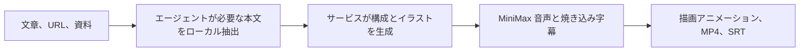

<div align="center">

# Explainer Video Agent Skill

**Codex、Claude Code、対応エージェントで、文章・Web ページ・資料をナレーション付き手描き解説動画に。**

[公式サイト](https://speedpainter.org) · [クイックスタート](#クイックスタート) · [プライバシー](https://speedpainter.org/en/privacy) · [サポート](https://speedpainter.org/en/contact)

</div>

<p align="center">
  <a href="../README.md">English</a> ·
  <a href="README.zh-CN.md">简体中文</a> ·
  <strong>日本語</strong> ·
  <a href="README.es.md">Español</a>
</p>

## ひとこと頼むだけで、完成動画まで

Explainer Video は、移植可能な Agent Skill とホスト型 MCP サービスを
組み合わせています。エージェントが元資料をローカルで読み取り、サービスが
構成案、統一感のあるホワイトボードイラスト、MiniMax ナレーション、焼き込み
字幕、描画アニメーションを生成し、公開済み MP4 を返します。

タイムライン編集、Docker、ローカルレンダラー、API キーは不要です。

## クイックスタート

### Codex

```bash
codex plugin marketplace add SpeedPainterOrg/explainer-video --ref main
codex plugin add explainer-video@speedpainter
```

インストール後に新しい Codex タスクを開始してください。Skill とリモート MCP
接続はプラグインに同梱されています。

### Claude Code

まず共通 Skill をインストールします。

```bash
npx skills add https://github.com/SpeedPainterOrg/explainer-video \
  --skill create-explainer-video
```

次に、すべてのプロジェクトで使う MCP サーバーを追加します。

```bash
claude mcp add --transport http --scope user \
  explainer-video https://api.speedpainter.org/mcp
```

Claude Code 内で `/mcp` を開き、Google ログインを完了してください。

### その他の対応クライアント

`plugins/explainer-video/skills/create-explainer-video/` を、クライアントの
個人用またはプロジェクト用 Skill ディレクトリへそのままコピーします。続いて、
OAuth 対応の Streamable HTTP MCP を設定してください。

```text
https://api.speedpainter.org/mcp
```

一連の生成を実行するには、Agent Skill とリモート MCP OAuth の両方に対応した
クライアントが必要です。

## 自然な言葉で依頼できます

```text
この PDF を 60 秒の解説動画にしてください。

このページから 45 秒・9:16 の解説動画を作ってください。

この会議メモを簡潔な日本語のホワイトボード動画にしてください。

これを動画にして。
```

既定値は、元資料の言語、60 秒、16:9、MiniMax ナレーション、BGM なし、
焼き込み字幕です。長さ、言語、縦横比、声、音楽、字幕方式は指定できます。

動画の長さは 5 秒から 5 分までです。30 秒未満も生成できますが、描画と
ナレーションが慌ただしく感じられる場合があります。

## 2 つの制作モード

**通常は直接生成します。** サービスが 1 つの非同期タスクで、構成、画像、
音声、字幕、レンダリング、公開まで処理します。クライアントを問わず、最短で
安定した結果を得られるモードです。

**必要な場合だけ詳細レビューを使います。** レンダリング前にシーン画像を確認・
編集したいと伝えると、対応エージェントは番号付き絵コンテを表示し、指定した
シーンだけを再生成します。承認済み画像だけをアップロードし、マニフェストを
検証してからレンダリングします。

## 処理の流れ



タスクにはレンダラーが返した実際の工程と進捗だけが表示されます。Skill が
架空の進捗率を作ることはなく、サーバーのポーリング、再試行、完了、キャンセル
指示に従います。

## 対応範囲

| 項目 | 対応内容 |
| --- | --- |
| 入力 | エージェントが読める文章、URL、PDF、資料、メモ、既存の絵コンテ |
| 長さ | 5–300 秒、既定は 60 秒 |
| 縦横比 | 16:9、9:16、1:1、4:5 |
| 映像 | 編集イラスト風の手描きホワイトボードと描画アニメーション |
| 音声 | MiniMax によるホスト型多言語音声合成 |
| 字幕 | 既定で MP4 に焼き込み、利用可能な場合は SRT も提供 |
| 出力 | 公開 MP4 URL、字幕 URL、正確なタスク状態 |

## プライバシーとログイン

- 元ファイルはエージェントが読み取り、このプラグイン自体はアップロードしません。
- 直接生成では、動画制作に必要な抽出テキストだけをサービスへ送ります。
- 詳細レビューでは、承認済みの生成画像とマニフェストだけを送ります。
- Google ログインによる MCP OAuth を使用し、初回利用時に無料アカウントを
  自動作成します。
- API キーやレンダラー、ストレージ、音声サービスの秘密情報を会話へ貼る必要は
  ありません。

[プライバシーポリシー](https://speedpainter.org/en/privacy)と
[利用規約](https://speedpainter.org/en/terms)をご確認ください。

## 更新

Codex：

```bash
codex plugin marketplace upgrade speedpainter
```

Claude Code / 単体 Skill：

```bash
npx skills add https://github.com/SpeedPainterOrg/explainer-video \
  --skill create-explainer-video
```

更新後は新しいエージェントセッションを開始してください。

## リンク

- [公式サイト](https://speedpainter.org)
- [プライバシーポリシー](https://speedpainter.org/en/privacy)
- [利用規約](https://speedpainter.org/en/terms)
- [サポート](https://speedpainter.org/en/contact)
- [Issue を報告](https://github.com/SpeedPainterOrg/explainer-video/issues)
