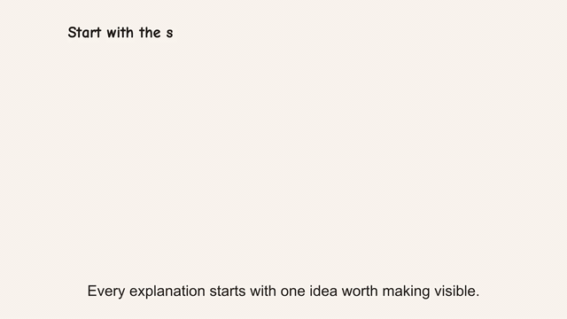

<div align="center">

# Explainer Video

**文章、Web ページ、資料をナレーションと字幕付きの手描き解説動画に。**

[公式サイト](https://speedpainter.org) · [デモ](https://cdn.jsdelivr.net/gh/SpeedPainterOrg/explainer-video@v0.5.1/assets/explainer-video-demo.mp4) · [プライバシー](https://speedpainter.org/en/privacy) · [サポート](https://speedpainter.org/en/contact)

</div>

<p align="center">
  <a href="../README.md">English</a> ·
  <a href="README.zh-CN.md">简体中文</a> ·
  <strong>日本語</strong> ·
  <a href="README.es.md">Español</a>
</p>

## 実際の動画を見る

[](https://cdn.jsdelivr.net/gh/SpeedPainterOrg/explainer-video@v0.5.1/assets/explainer-video-demo.mp4)

[ナレーションと焼き込み字幕付きの完成動画を見る。](https://cdn.jsdelivr.net/gh/SpeedPainterOrg/explainer-video@v0.5.1/assets/explainer-video-demo.mp4)

## インストール

```bash
npx --yes github:SpeedPainterOrg/explainer-video
```

インストーラーが Codex と Claude Code を自動判別します。インストール後に
新しいセッションを開始し、認証を求められた場合だけ Google にログインします。

## 動画を作る

```text
1930 年の第 1 回大会から現在まで、FIFA ワールドカップの歴史を 30 秒の
解説動画にしてください。
```

文章、URL、資料を渡すだけで利用できます。必要に応じて言語、長さ、縦横比、
声、音楽、字幕を指定でき、指定しない項目には適切な既定値が使われます。

## プライバシー

- 元ファイルはエージェントがローカルで読み取り、ファイル自体は送信しません。
- 動画制作に必要な抽出テキストだけをサービスへ送ります。
- 画像、音声、ストレージ、レンダラーの API キーは不要です。

[プライバシーポリシー](https://speedpainter.org/en/privacy) · [利用規約](https://speedpainter.org/en/terms) · [サポート](https://speedpainter.org/en/contact) · [問題を報告](https://github.com/SpeedPainterOrg/explainer-video/issues)
