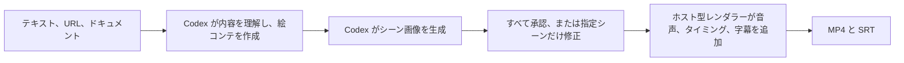

<div align="center">

# Codex 向け Explainer Video

**テキスト、URL、ドキュメントから、ナレーション付きの手描き解説動画を Codex 内で作成します。**

[公式サイト](https://speedpainter.org) · [クイックスタート](#クイックスタート) · [プライバシー](https://speedpainter.org/en/privacy) · [サポート](https://speedpainter.org/en/contact)

</div>

<p align="center">
  <a href="../README.md">English</a> ·
  <a href="README.zh-CN.md">简体中文</a> ·
  <strong>日本語</strong> ·
  <a href="README.es.md">Español</a>
</p>

## 素材を渡すだけで、完成動画まで

Explainer Video では、Codex が元の内容を理解し、要点を整理して絵コンテと統一感のあるホワイトボードイラストを作成します。その後、ホスト型レンダラーが承認済みの素材を、描画アニメーション、自然なナレーション、焼き込み字幕付きの MP4 に仕上げます。

タイムライン編集、Docker、ローカルレンダラー、API キーは必要ありません。

## クイックスタート

### 1. プラグインをインストール

```bash
codex plugin marketplace add SpeedPainterOrg/explainer-video --ref main
codex plugin add explainer-video@speedpainter
```

### 2. Codex で新しいタスクを開始

プラグインはタスク開始時に読み込まれます。インストール後に新しいタスクを開き、ドキュメントを添付するか、テキストまたは URL を入力してください。

### 3. 欲しい動画をそのまま依頼

```text
この PDF を 60 秒の解説動画にしてください。
```

初回レンダリング時に Google ログインが開きます。認証後は、Codex が絵コンテ、イラスト、ナレーション、字幕、レンダリング、納品まで進めます。

## プロンプト例

```text
このページから、45 秒・9:16 の解説動画を作ってください。

この会議メモを、簡潔な日本語のホワイトボード動画にまとめてください。

初心者向けに説明し、温かみのあるエディトリアルイラストと焼き込み字幕を使ってください。
```

短い依頼でも利用できます。

```text
これを動画にして。
```

Codex が適切な初期設定を補うため、レンダリング設定を覚える必要はありません。必要に応じて、言語、長さ、アスペクト比、強調したい内容、ナレーションの方向性を指定できます。

通常は、時間付きの絵コンテと番号付きのシーン画像をアップロード前に確認できます。すべて承認することも、指定したシーンだけを修正することも可能です。最短で完成させたい場合は「画像レビューをスキップ」と伝えてください。

## 対応範囲

| 項目 | 内容 |
|---|---|
| 入力 | Codex が参照できるテキスト、URL、PDF、ドキュメント、メモ |
| 長さ | 5 秒〜5 分、初期設定は 60 秒 |
| ビジュアル | 約 10 秒ごとに 1 シーン。通常の 60 秒では 6 シーン、最大 30 シーン |
| アスペクト比 | 初期設定は 16:9。9:16、1:1 などの指定にも対応 |
| ナレーション | ホスト型の自然音声合成 |
| 字幕 | MP4 に焼き込み。利用可能な場合は SRT も提供 |
| 出力 | 公開済み MP4 の URL、動画時間、シーン概要 |

30 秒未満も作成できますが、30 秒以上のほうがナレーションと描画のテンポを自然に整えやすくなります。

## 処理の流れ



使い方をシンプルに保ちながら、Codex とレンダラーの責任範囲を明確に分けています。

| Codex | ホスト型レンダラー |
|---|---|
| 元の素材を読み取る | 生成済みのシーン画像と承認済みレンダーマニフェストのみ受け取る |
| メッセージと対象視聴者を整理する | イラスト素材を動画向けに整える |
| 絵コンテ、見出し、ナレーションを書く | レイアウト、描画タイミング、音声合成を処理する |
| シーン画像を生成する | 字幕の焼き込み、レンダリング、公開、実際の処理段階と進捗の通知を行う |

## プライバシーと認証

- 元のドキュメント、URL の本文、個人的なメモは Codex 内に残ります。
- レンダラーに送信されるのは、生成済みのシーン画像と動画制作に必要な承認済みマニフェストだけです。マニフェストにはナレーション、短い見出し、字幕、レンダリング設定が含まれます。
- 認証には MCP OAuth と Google ログインを使用します。
- Codex に API キーやサービス認証情報を貼り付ける必要はありません。

詳しくは、[プライバシーポリシー](https://speedpainter.org/en/privacy)と[利用規約](https://speedpainter.org/en/terms)をご覧ください。

## 更新

marketplace のスナップショットを更新すると、最新バージョンを取得できます。

```bash
codex plugin marketplace upgrade speedpainter
```

更新後は新しい Codex タスクを開始してください。

## リポジトリ構成

```text
.
├── .agents/plugins/marketplace.json
└── plugins/explainer-video
    ├── .codex-plugin/plugin.json
    ├── .mcp.json
    └── skills/create-explainer-video/SKILL.md
```

このリポジトリには、ソースを確認できる Codex プラグイン配布ファイルが含まれます。ホスト型レンダリングサービスとバックエンドの実装はプロプライエタリであり、このリポジトリには含まれません。

## リンク

- [SpeedPainter](https://speedpainter.org)
- [プライバシーポリシー](https://speedpainter.org/en/privacy)
- [利用規約](https://speedpainter.org/en/terms)
- [サポート窓口](https://speedpainter.org/en/contact)
- [問題を報告](https://github.com/SpeedPainterOrg/explainer-video/issues)
