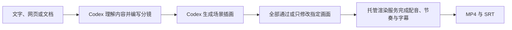

<div align="center">

# Codex Explainer Video 插件

**把文字、网页和文档直接变成带配音、手绘动画与字幕的解释视频。**

[官方网站](https://speedpainter.org) · [快速安装](#快速开始) · [隐私政策](https://speedpainter.org/en/privacy) · [联系支持](https://speedpainter.org/en/contact)

</div>

<p align="center">
  <a href="../README.md">English</a> ·
  <strong>简体中文</strong> ·
  <a href="README.ja.md">日本語</a> ·
  <a href="README.es.md">Español</a>
</p>

## 给出内容，直接拿到成片

Explainer Video 会让 Codex 负责它擅长的创作工作：理解原始内容、提炼核心观点、编写分镜，并生成风格统一的白板插画。托管渲染服务再把确认后的素材制作成带手绘过程、自然配音和烧录字幕的 MP4 视频。

你不需要剪时间线，也不需要部署 Docker、本地渲染器或配置 API Key。

## 快速开始

### 1. 安装插件

```bash
codex plugin marketplace add SpeedPainterOrg/explainer-video --ref main
codex plugin add explainer-video@speedpainter
```

### 2. 新建一个 Codex 任务

插件会在任务启动时加载。安装完成后，请新建任务，然后上传文档、粘贴文字或提供网页地址。

### 3. 直接描述你要的结果

```text
把这个 PDF 做成一个 60 秒的解释视频。
```

首次渲染会打开 Google 登录。完成授权后，Codex 会继续完成分镜、插画、配音、字幕、渲染和成片交付。

## 你可以这样说

```text
把这个网页做成 45 秒的 9:16 解释视频。

把这些会议记录整理成一个简洁的中文白板视频。

面向初学者解释这个概念，使用温暖的编辑插画风格，并烧录字幕。
```

简短指令同样可以：

```text
把这个做成视频。
```

Codex 会自动补齐合理的默认设置，不会让你先学习渲染参数。如果有明确要求，也可以指定语言、时长、画面比例、表达重点或配音方向。

默认情况下，Codex 会先展示带时间段的分镜和编号场景图。你可以一次全部通过，也可以只修改指定画面；如果追求最快速度，直接说“跳过审图”即可自动进入渲染。

## 能力范围

| 项目 | 支持范围 |
|---|---|
| 输入 | Codex 可以访问的文字、网页、PDF、文档和笔记 |
| 时长 | 5 秒至 5 分钟，默认 60 秒 |
| 画面 | 约每 10 秒一幕；默认 60 秒生成 6 幕，最长支持 30 幕 |
| 画面比例 | 默认 16:9，也支持按要求使用 9:16、1:1 等比例 |
| 配音 | 托管的自然语言语音合成 |
| 字幕 | 烧录进 MP4，并在可用时另外提供 SRT 文件 |
| 输出 | 可播放的 MP4 地址、视频时长和分镜摘要 |

系统支持 30 秒以内的视频，但 30 秒及以上通常能让讲述和手绘节奏更自然。

## 工作方式



插件让使用过程保持简单，同时明确划分 Codex 与后端的职责：

| Codex | 托管渲染服务 |
|---|---|
| 阅读原始内容 | 只接收生成后的场景图片和确认过的渲染清单 |
| 判断核心信息和受众 | 统一处理插画素材 |
| 编写分镜、标题和旁白 | 完成排版、手绘节奏和语音合成 |
| 生成场景插画 | 烧录字幕、渲染、发布并返回真实阶段和进度 |

## 隐私与登录

- 原始文档、网页正文和私人笔记保留在 Codex 中。
- 渲染服务只接收生成后的场景插画，以及制作视频必需且已经确认的渲染清单；清单中包含旁白、短标题、字幕和渲染设置。
- 登录使用 MCP OAuth 和 Google 授权。
- 你不需要在 Codex 对话中粘贴 API Key 或服务凭据。

托管服务的具体条款请查看[隐私政策](https://speedpainter.org/en/privacy)和[服务条款](https://speedpainter.org/en/terms)。

## 更新插件

刷新 marketplace，即可获取最新发布版本：

```bash
codex plugin marketplace upgrade speedpainter
```

更新后请新建一个 Codex 任务。

## 仓库结构

```text
.
├── .agents/plugins/marketplace.json
└── plugins/explainer-video
    ├── .codex-plugin/plugin.json
    ├── .mcp.json
    └── skills/create-explainer-video/SKILL.md
```

本仓库提供可查看源码的 Codex 插件发布文件。托管渲染服务和后端实现属于专有服务，不包含在本仓库中。

## 相关链接

- [SpeedPainter 官网](https://speedpainter.org)
- [隐私政策](https://speedpainter.org/en/privacy)
- [服务条款](https://speedpainter.org/en/terms)
- [联系支持](https://speedpainter.org/en/contact)
- [提交问题](https://github.com/SpeedPainterOrg/explainer-video/issues)
