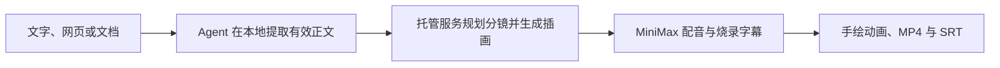

<div align="center">

# Explainer Video Agent Skill

**在 Codex、Claude Code 和兼容的 Agent 客户端里，把文字、网页和文档直接做成带配音的手绘解释视频。**

[官方网站](https://speedpainter.org) · [快速安装](#快速开始) · [隐私政策](https://speedpainter.org/en/privacy) · [联系支持](https://speedpainter.org/en/contact)

</div>

<p align="center">
  <a href="../README.md">English</a> ·
  <strong>简体中文</strong> ·
  <a href="README.ja.md">日本語</a> ·
  <a href="README.es.md">Español</a>
</p>

## 给出内容，直接拿到成片

Explainer Video 由一个可移植的 Agent Skill 和托管 MCP 服务组成。你的
Agent 在本地读取原始内容；服务端负责规划分镜、生成风格统一的白板插画、
制作 MiniMax 配音与烧录字幕、渲染手绘动画，并返回可播放的 MP4。

你不需要剪时间线、部署 Docker、本地运行渲染器，也不需要配置 API Key。

## 快速开始

### Codex

```bash
codex plugin marketplace add SpeedPainterOrg/explainer-video --ref main
codex plugin add explainer-video@speedpainter
```

安装后新建一个 Codex 任务。插件已经同时包含 Skill 和远程 MCP 配置。

### Claude Code

先安装通用 Skill：

```bash
npx skills add https://github.com/SpeedPainterOrg/explainer-video \
  --skill create-explainer-video
```

再为所有项目接入托管 MCP：

```bash
claude mcp add --transport http --scope user \
  explainer-video https://api.speedpainter.org/mcp
```

进入 Claude Code 后打开 `/mcp`，按提示完成 Google 登录。

### 其他兼容客户端

把 `plugins/explainer-video/skills/create-explainer-video/` 整个目录复制到
客户端的个人或项目 Skill 目录，并配置下面这个支持 OAuth 的 Streamable
HTTP MCP：

```text
https://api.speedpainter.org/mcp
```

客户端需要同时支持 Agent Skill 和远程 MCP OAuth，才能执行完整成片流程。

## 直接说你想要什么

```text
把这个 PDF 做成一个 60 秒的解释视频。

把这个网页做成 45 秒的 9:16 解释视频。

把这些会议记录整理成一个简洁的中文白板视频。

把这个做成视频。
```

默认配置为：跟随原文语言、60 秒、16:9、MiniMax 配音、不加背景音乐、
烧录字幕。你也可以指定时长、语言、画面比例、音色、音乐或字幕模式。

单条视频支持 5 秒到 5 分钟。30 秒以内也能生成，但手绘和讲述节奏可能会
偏赶。

## 两种创作模式

**默认是直接生成。** 服务端在一个异步任务里完成分镜、生图、配音、字幕、
渲染和发布。这条路径操作最少，也最适合在不同客户端之间保持一致体验。

**需要时可以进入高级审图。** 只要明确说“先看分镜图”或“先审图”，具备
生图能力的 Agent 就会先展示编号分镜卡片，只重做你指定的场景，上传确认过
的图片，再校验清单并渲染，不影响已经通过的内容。

## 工作方式



任务状态只展示渲染器返回的真实阶段和进度，不会凭空估算百分比；Skill 会
按照服务端给出的轮询、重试、完成和取消指引继续执行。

## 能力范围

| 项目 | 支持范围 |
| --- | --- |
| 输入 | Agent 可以读取的文字、网页、PDF、文档、笔记和已有分镜 |
| 时长 | 5–300 秒，默认 60 秒 |
| 画面比例 | 16:9、9:16、1:1、4:5 |
| 视觉 | 编辑型手绘白板插画与绘制动画 |
| 配音 | 托管的 MiniMax 多语言语音合成 |
| 字幕 | 默认烧录进 MP4，并在可用时提供独立 SRT |
| 输出 | 公开 MP4 地址、字幕地址和真实任务状态 |

## 隐私与登录

- 原始文件由 Agent 读取，本插件不会上传原文件。
- 直接生成模式只把制作视频所需的提取文本发送给服务端。
- 高级审图模式只发送确认过的生成图片和渲染清单，不上传原始文档。
- 登录使用 MCP OAuth 和 Google 授权；首次使用会自动创建免费账户。
- 对话中不需要粘贴 API Key、渲染密钥、存储密钥或配音服务密钥。

请查看[隐私政策](https://speedpainter.org/en/privacy)和
[服务条款](https://speedpainter.org/en/terms)。

## 更新

Codex：

```bash
codex plugin marketplace upgrade speedpainter
```

Claude Code / 独立 Skill：

```bash
npx skills add https://github.com/SpeedPainterOrg/explainer-video \
  --skill create-explainer-video
```

更新后请新建一个 Agent 会话。

## 仓库结构

```text
.
├── .agents/plugins/marketplace.json
└── plugins/explainer-video
    ├── .codex-plugin/plugin.json
    ├── .mcp.json
    └── skills/create-explainer-video
        ├── SKILL.md
        └── references/advanced-review.md
```

本仓库提供可查看源码的分发包。托管渲染服务与后端实现属于专有服务，未包含
在此仓库中。

## 相关链接

- [官方网站](https://speedpainter.org)
- [隐私政策](https://speedpainter.org/en/privacy)
- [服务条款](https://speedpainter.org/en/terms)
- [联系支持](https://speedpainter.org/en/contact)
- [提交问题](https://github.com/SpeedPainterOrg/explainer-video/issues)
